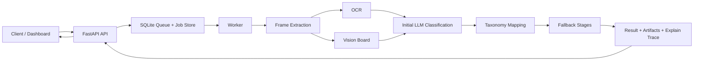

# Scenalyze Documentation

Scenalyze is a production-oriented video ad classification system. It accepts video jobs through a FastAPI API, executes them through a DB-backed worker queue, classifies ads with OCR, vision, LLM reasoning, taxonomy normalization, and bounded fallback stages, and exposes the full decision trail in the dashboard.

This documentation is organized around one factual core and two reading paths:

- Technical path: exact contracts, data flow, schemas, persistence, and operational behavior.
- Mental-model path: how to think about the system, how to read an explain trace, and how to debug failures without reading the whole codebase first.

## Start Here

- [Technical Guide](/Users/gsp/Projects/scenalyze/docs/technical/01-system-overview.md)
- [Mental Models Guide](/Users/gsp/Projects/scenalyze/docs/mental-models/README.md)
- [Glossary](/Users/gsp/Projects/scenalyze/docs/concepts/glossary.md)
- [Reference](/Users/gsp/Projects/scenalyze/docs/reference/api-reference.md)

## What This System Does

At a high level:

1. Accepts jobs by URL, folder, upload, or file path.
2. Claims queued jobs transactionally from SQLite.
3. Extracts a small but informative frame set.
4. Runs OCR, visual matching, and LLM classification.
5. Normalizes the raw LLM category into the FreeWheel taxonomy.
6. Runs bounded fallback stages when the first answer looks weak or contradictory.
7. Persists status, stage, artifacts, logs, and the explain trace.
8. Serves job state and explanation details through the API and dashboard.

## Reading Paths

### Technical Guide

Read this path if you need to modify the system safely.

1. [System Overview](/Users/gsp/Projects/scenalyze/docs/technical/01-system-overview.md)
2. [Job Lifecycle and Worker Flow](/Users/gsp/Projects/scenalyze/docs/technical/02-job-lifecycle-and-worker-flow.md)
3. [Classification Pipeline](/Users/gsp/Projects/scenalyze/docs/technical/03-classification-pipeline.md)
4. [Taxonomy Mapping and Family Selection](/Users/gsp/Projects/scenalyze/docs/technical/04-taxonomy-mapping-and-family-selection.md)
5. [LLM Contracts, Search, and Brand Review](/Users/gsp/Projects/scenalyze/docs/technical/05-llm-contracts-search-and-brand-review.md)
6. [Cluster, API, and Persistence](/Users/gsp/Projects/scenalyze/docs/technical/06-ha-cluster-api-and-persistence.md)
7. [Observability, Dashboard, and Explainability](/Users/gsp/Projects/scenalyze/docs/technical/07-observability-dashboard-and-explainability.md)
8. [Testing, Operations, and Safe Change Workflow](/Users/gsp/Projects/scenalyze/docs/technical/08-testing-operations-and-safe-change-workflow.md)
9. [Deployment and Runbooks](/Users/gsp/Projects/scenalyze/docs/technical/09-deployment-and-runbooks.md)

### Mental Models Guide

Read this path if you need a durable understanding of how the system behaves.

1. [System in One Page](/Users/gsp/Projects/scenalyze/docs/mental-models/01-system-in-one-page.md)
2. [How to Think About Decisions](/Users/gsp/Projects/scenalyze/docs/mental-models/02-how-to-think-about-decisions.md)
3. [How to Debug a Bad Classification](/Users/gsp/Projects/scenalyze/docs/mental-models/03-how-to-debug-a-bad-classification.md)
4. [Common Confusions](/Users/gsp/Projects/scenalyze/docs/mental-models/04-common-confusions.md)

## Repo Landmarks

- API entry point: [/Users/gsp/Projects/scenalyze/video_service/app/main.py](/Users/gsp/Projects/scenalyze/video_service/app/main.py)
- Worker: [/Users/gsp/Projects/scenalyze/video_service/workers/worker.py](/Users/gsp/Projects/scenalyze/video_service/workers/worker.py)
- Pipeline: [/Users/gsp/Projects/scenalyze/video_service/core/pipeline.py](/Users/gsp/Projects/scenalyze/video_service/core/pipeline.py)
- LLM layer: [/Users/gsp/Projects/scenalyze/video_service/core/llm.py](/Users/gsp/Projects/scenalyze/video_service/core/llm.py)
- Taxonomy and mapping: [/Users/gsp/Projects/scenalyze/video_service/core/categories.py](/Users/gsp/Projects/scenalyze/video_service/core/categories.py), [/Users/gsp/Projects/scenalyze/video_service/core/category_mapping.py](/Users/gsp/Projects/scenalyze/video_service/core/category_mapping.py)
- DB: [/Users/gsp/Projects/scenalyze/video_service/db/database.py](/Users/gsp/Projects/scenalyze/video_service/db/database.py)
- Dashboard explain UI: [/Users/gsp/Projects/scenalyze/frontend/src/pages/JobDetail.tsx](/Users/gsp/Projects/scenalyze/frontend/src/pages/JobDetail.tsx)
- Behavioral reference: [/Users/gsp/Projects/scenalyze/poc/combined.py](/Users/gsp/Projects/scenalyze/poc/combined.py)

## Scope Boundaries

- This is a video ad classifier, not an audio-language gate.
- OCR, vision, LLM, taxonomy mapping, and explainability are first-class system concerns.
- HA routing is part of the product, not a deployment-only detail.
- Observability is not optional; every job should be explainable after the fact.
