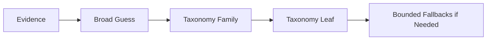

# Mental Model 01: System in One Page

The simplest useful way to think about Scenalyze is:

> It is a funnel that starts broad, then proves narrower decisions step by step.

It does not simply ask:

> “What category is this ad?”

It asks several smaller questions:

1. What visual and textual evidence do we have?
2. What brand and broad category does the ad seem to suggest?
3. Which taxonomy family does that broad category really belong to?
4. Which leaf inside that family is actually supported?
5. If the answer is weak, what bounded fallback is appropriate?

This is why many “weird” results are not random. They usually come from the system narrowing too early, or narrowing inside the wrong family.
