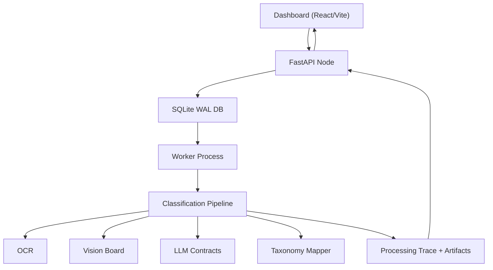

# Technical Guide 01: System Overview

Scenalyze is a production-oriented service for classifying video advertisements into a FreeWheel-style industry taxonomy. It is not a single model call. It is a distributed, observable pipeline with explicit queueing, bounded refinement stages, and an explain trail.

## Primary Components

- API server
  - FastAPI entry point in [/Users/gsp/Projects/scenalyze/video_service/app/main.py](/Users/gsp/Projects/scenalyze/video_service/app/main.py)
  - Owns submission, retrieval, diagnostics, aggregation, and static artifact serving
- Worker
  - DB-backed background executor in [/Users/gsp/Projects/scenalyze/video_service/workers/worker.py](/Users/gsp/Projects/scenalyze/video_service/workers/worker.py)
  - Claims jobs transactionally and persists stage-by-stage progress
- Core pipeline
  - Classification logic in [/Users/gsp/Projects/scenalyze/video_service/core/pipeline.py](/Users/gsp/Projects/scenalyze/video_service/core/pipeline.py)
  - Includes frame extraction, OCR, visual scoring, initial classification, mapping, and fallbacks
- LLM integration layer
  - Provider abstraction and task-specific JSON contracts in [/Users/gsp/Projects/scenalyze/video_service/core/llm.py](/Users/gsp/Projects/scenalyze/video_service/core/llm.py)
- Taxonomy and mapping
  - Taxonomy loader and mapper in [/Users/gsp/Projects/scenalyze/video_service/core/categories.py](/Users/gsp/Projects/scenalyze/video_service/core/categories.py)
  - Broad-label heuristics and cue-building helpers in [/Users/gsp/Projects/scenalyze/video_service/core/category_mapping.py](/Users/gsp/Projects/scenalyze/video_service/core/category_mapping.py)
- Dashboard
  - React/Vite UI in [/Users/gsp/Projects/scenalyze/frontend/src](/Users/gsp/Projects/scenalyze/frontend/src)

## Topology

## Design Constraints

- Behavior should stay aligned with [/Users/gsp/Projects/scenalyze/poc/combined.py](/Users/gsp/Projects/scenalyze/poc/combined.py) unless deliberately changed and parity-tested.
- No standalone audio gate logic.
- HA cluster semantics must remain intact:
  - shared-nothing nodes
  - round-robin placement
  - proxy-to-owner for job-specific reads
- Observability is a product requirement:
  - stage and stage detail are persisted
  - logs are job-correlated
  - explanation data is stored as artifacts

## Architectural Idea

Scenalyze intentionally separates:

1. Evidence gathering
   - frames
   - OCR
   - visual matches
   - optional web snippets
2. Broad classification
   - brand
   - raw category
3. Taxonomy normalization
   - canonical category selection
4. Bounded corrections
   - family selection
   - leaf rerank
   - entity search rescue
   - specificity rescue
5. Explanation
   - attempts
   - accepted path
   - rejected paths with reasons

That separation is the reason the same job can show:

- an initial raw category like `Banking`
- a mapped category like `Banks and Credit Unions`
- a rejected category-rerank card that also chose `Banks and Credit Unions`

The final result is about the accepted canonical taxonomy state, not about whether every refinement step was accepted.
