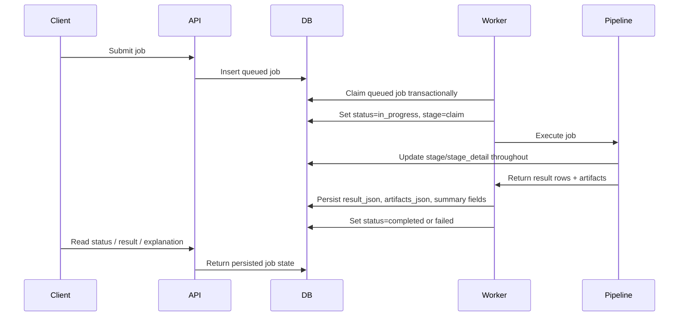

# Technical Guide 02: Job Lifecycle and Worker Flow

This section describes the operational path of a job through the API, DB, worker, and persistence layers.

## Submission to Completion

## API Submission Endpoints

Primary job entry points in [/Users/gsp/Projects/scenalyze/video_service/app/main.py](/Users/gsp/Projects/scenalyze/video_service/app/main.py):

- `POST /jobs/by-urls`
- `POST /jobs/by-folder`
- `POST /jobs/by-filepath`
- `POST /jobs/upload`

The API stores a queued row in SQLite, including:

- `id`
- `status`
- `stage`
- `stage_detail`
- `settings`
- `mode`
- source URL or path fields

## Worker Claiming Model

The worker uses a DB-backed queue. Important properties:

- SQLite is configured with WAL mode.
- busy timeout is set per connection.
- one worker process claims one job at a time.
- claiming is transactional, so the same queued job should not be executed twice.

Relevant code:

- [/Users/gsp/Projects/scenalyze/video_service/db/database.py](/Users/gsp/Projects/scenalyze/video_service/db/database.py)
- [/Users/gsp/Projects/scenalyze/video_service/workers/worker.py](/Users/gsp/Projects/scenalyze/video_service/workers/worker.py)

## Persisted Job Fields

The `jobs` table contains:

- lifecycle:
  - `status`
  - `stage`
  - `stage_detail`
  - `progress`
  - `error`
- classification summary:
  - `brand`
  - `category`
  - `category_id`
- payloads:
  - `settings`
  - `result_json`
  - `artifacts_json`
  - `events`

The `job_stats` table stores a compact analytics view after completion.

## Stage Semantics

Stages are recorded both in logs and in the DB. Typical stages include:

- `ingest`
- `claim`
- `frame_extract`
- `ocr`
- `vision`
- `llm`
- `persist`
- `completed`

The point of `stage` is operational status, not decision provenance. Decision provenance lives in the processing trace.

## Artifacts

Workers save and persist structured artifacts for later inspection:

- latest frame gallery
- LLM frame gallery
- OCR text and OCR text URL
- vision board top matches and plot metadata
- category mapper details
- processing trace

This is why a completed job remains inspectable after execution is over.
