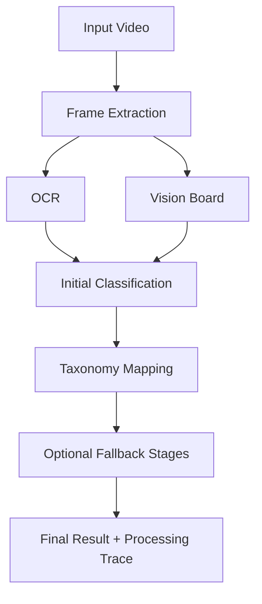

# Technical Guide 03: Classification Pipeline

The classification pipeline is intentionally multi-stage. The first LLM answer is important, but it is not the whole system.

## High-Level Flow

## Core Steps

### 1. Frame Extraction

The pipeline extracts a compact frame set optimized for ad end cards and title surfaces. Rescue modes can later widen this:

- initial tail scan
- OCR rescue
- express rescue
- extended tail
- full video

### 2. OCR

OCR is evidence gathering, not classification. The system includes:

- frame prefiltering
- OCR deduplication
- ROI-first behavior for EasyOCR
- skip heuristics for visually redundant frames

The goal is to surface useful textual anchors without flooding the LLM with duplicate text.

### 3. Vision Board

Vision board scores are lightweight visual hints. They provide:

- category similarity scores
- support or contradiction against textual classification
- candidate generation hints for later rerank

They are evidence, not the final classifier.

### 4. Initial LLM Classification

The first model pass produces:

- `brand`
- `category`
- `confidence`
- `reasoning`

This is a broad interpretation step, not a final taxonomy guarantee.

### 5. Taxonomy Mapping

The raw category string is normalized into the category tree through embedding retrieval and supporting heuristics. This is where a raw category like `Banking` becomes a canonical taxonomy label like `Banks and Credit Unions`.

### 6. Fallback Stages

Fallbacks exist to correct weak or contradictory results. Common fallback types:

- `ocr_rescue`
- `express_rescue`
- `extended_tail`
- `full_video`
- `entity_search_rescue`
- `category_rerank`
- `specificity_search_rescue`

Each attempt is stored in the processing trace as accepted or rejected.

## Why the Pipeline Is Layered

If the system jumped directly from OCR text to a taxonomy leaf, it would make brittle mistakes:

- broad category collapsing into an unsupported leaf
- wrong family chosen from superficial similarity
- media-specific search rescue applied to a non-media ad

The layered design exists to force the system to prove progressively narrower decisions.
