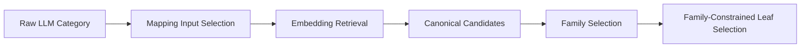

# Technical Guide 04: Taxonomy Mapping and Family Selection

This section describes how Scenalyze turns freeform category text into a canonical taxonomy label without letting the embedding mapper dominate everything.

## The Problem

Raw LLM categories are often broad or colloquial:

- `Banking`
- `Food & Beverage`
- `Movie`
- `Children's Toys`

The taxonomy is narrower and hierarchical. A direct nearest-neighbor lookup can produce bad specificity jumps:

- `Food & Beverage` -> `Alcoholic beverages`
- `Movie` -> `Movie Theatres`
- `Children's Toys` -> `Boy toys`

## Mapping Layers

## Mapping Input Selection

Broad freeform categories are not always sent to the mapper as-is. The system first asks:

- does the raw category look generic?
- do the top neighbors scatter across unrelated families?
- do OCR and reasoning provide better discriminative tokens?

If yes, mapping input is enriched with evidence instead of trusting only the umbrella phrase.

Relevant files:

- [/Users/gsp/Projects/scenalyze/video_service/core/category_mapping.py](/Users/gsp/Projects/scenalyze/video_service/core/category_mapping.py)
- [/Users/gsp/Projects/scenalyze/video_service/core/categories.py](/Users/gsp/Projects/scenalyze/video_service/core/categories.py)

## Broadness Detection

Broadness is not only keyword-based. The current system also uses:

- taxonomy-derived branch token statistics
- top-neighbor family dispersion
- token overlap between evidence and candidate labels

This matters because broadness is a structural property, not just a wording trick.

## Family Selection

When leaf candidates are weak, Scenalyze chooses a taxonomy family before leaf rerank.

Examples:

- financial institution family
- OTC pharmaceutical family
- cinema genre family
- toy manufacture family

The family step narrows the candidate space to a coherent branch so the leaf step cannot accidentally jump into a semantically different family.

## Why `family_text` Exists

The backend renders a numbered menu of family choices for the model. That prompt text is called `family_text`.

- `family_text` is input formatting
- `family_index` is the strict JSON output contract

So the model sees a numbered list of families, then returns the chosen `family_index`.

## Acceptance Logic

Family selection and leaf rerank are both bounded:

- the model must choose from the provided numbered set
- retries use the same structured schema
- only limited exact-text recovery is allowed when provider compliance is imperfect

The point is to keep taxonomy decisions inside the candidate set rather than allowing freeform category invention.
