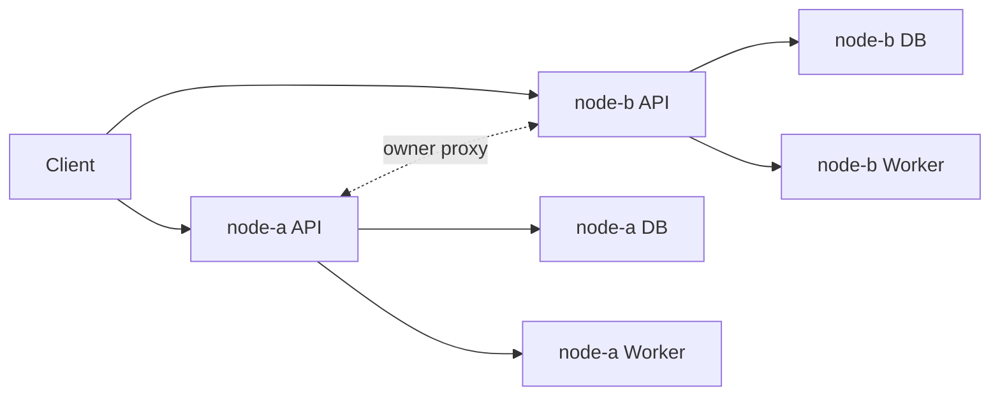

# Technical Guide 06: HA Cluster, API, and Persistence

Scenalyze is designed as a shared-nothing cluster, not a single monolith with a shared DB.

## Cluster Model

Implemented in [/Users/gsp/Projects/scenalyze/video_service/core/cluster.py](/Users/gsp/Projects/scenalyze/video_service/core/cluster.py).

Properties:

- each node has its own FastAPI instance
- each node has its own SQLite database
- new job placement is round-robin across healthy nodes
- job-specific reads proxy to the owner node
- job IDs are owner-prefixed: `<node-name>-<uuid>`
- cluster-wide listings aggregate across nodes and dedupe by `job_id`

## API Surface

Primary jobs endpoints:

- `POST /jobs/by-urls`
- `POST /jobs/by-folder`
- `POST /jobs/by-filepath`
- `POST /jobs/upload`
- `GET /jobs`
- `GET /jobs/{job_id}`
- `GET /jobs/{job_id}/result`
- `GET /jobs/{job_id}/artifacts`
- `GET /jobs/{job_id}/events`
- `GET /jobs/{job_id}/explanation`
- `DELETE /jobs/{job_id}`
- `POST /jobs/bulk-delete`

Cluster and diagnostics endpoints:

- `GET /cluster/nodes`
- `GET /cluster/jobs`
- `GET /cluster/analytics`
- `GET /health`
- `GET /diagnostics/device`
- `GET /diagnostics/concurrency`
- `GET /diagnostics/watcher`
- `GET /diagnostics/category`
- `GET /diagnostics/categories`
- `GET /metrics`

Benchmark endpoints also exist and are part of the same API surface.

## Persistence

SQLite configuration in [/Users/gsp/Projects/scenalyze/video_service/db/database.py](/Users/gsp/Projects/scenalyze/video_service/db/database.py):

- WAL journal mode
- `busy_timeout`
- deterministic DB path resolution by node

Important tables:

- `jobs`
- `job_stats`
- `benchmark_truth`
- `benchmark_suites`
- `benchmark_result`

## Why Shared-Nothing Matters

This design keeps ownership simple:

- the node that created the job owns the job
- reads can be proxied deterministically
- no distributed lock manager is needed
- cluster aggregation remains a read-time fan-out operation
