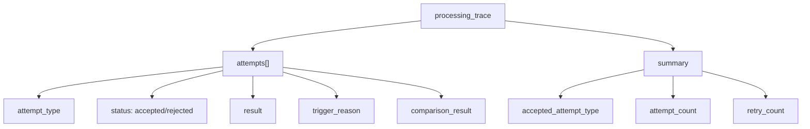

# Technical Guide 07: Observability, Dashboard, and Explainability

Scenalyze treats observability as a product feature.

## Logs and Stage Tracking

The backend uses structured logging and context propagation so job logs include:

- timestamp
- level
- `job_id`
- `stage`
- message

Stages are also persisted into the `jobs` row as:

- `stage`
- `stage_detail`

This lets the dashboard show both the operational state and the decision trail.

## Processing Trace

The explain model is persisted as `processing_trace` inside `artifacts_json`.

At a high level:

Attempt types currently include:

- `initial`
- `ocr_rescue`
- `express_rescue`
- `extended_tail`
- `full_video`
- `entity_search_rescue`
- `category_rerank`
- `specificity_search_rescue`
- synthetic frontend-only: `brand_review`

## Explain Tab Semantics

Important mental model:

- green accepted card: this attempt became the final result
- red rejected card: this attempt ran but was not applied

A rejected refinement does not imply the final result is rejected. It often means:

- the refinement was invalid
- the refinement tried to choose something outside the candidate set
- the refinement produced the same canonical category already in force

That last case is the source of many user questions. If rerank proposes the same canonical category the mapper already had, rerank is rejected as `unchanged_category`, but the final job still keeps that category.

## Dashboard Areas

The dashboard currently exposes:

- job table status and stage information
- job detail summary
- result and taxonomy identifiers
- artifact galleries
- processing trace cards
- brand review card when ambiguity metadata exists

Relevant UI file:

- [/Users/gsp/Projects/scenalyze/frontend/src/pages/JobDetail.tsx](/Users/gsp/Projects/scenalyze/frontend/src/pages/JobDetail.tsx)
