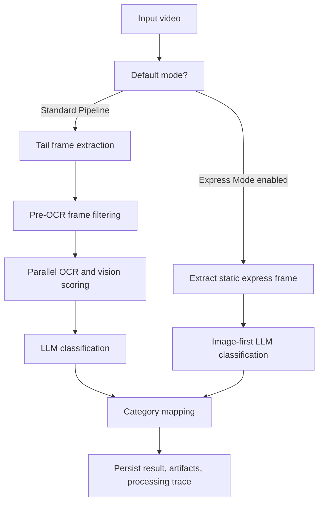
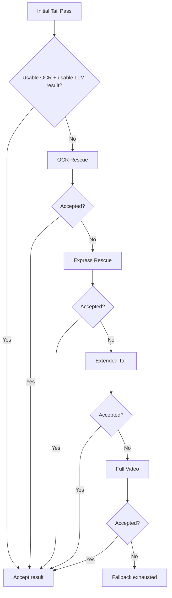
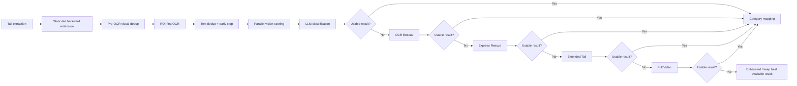
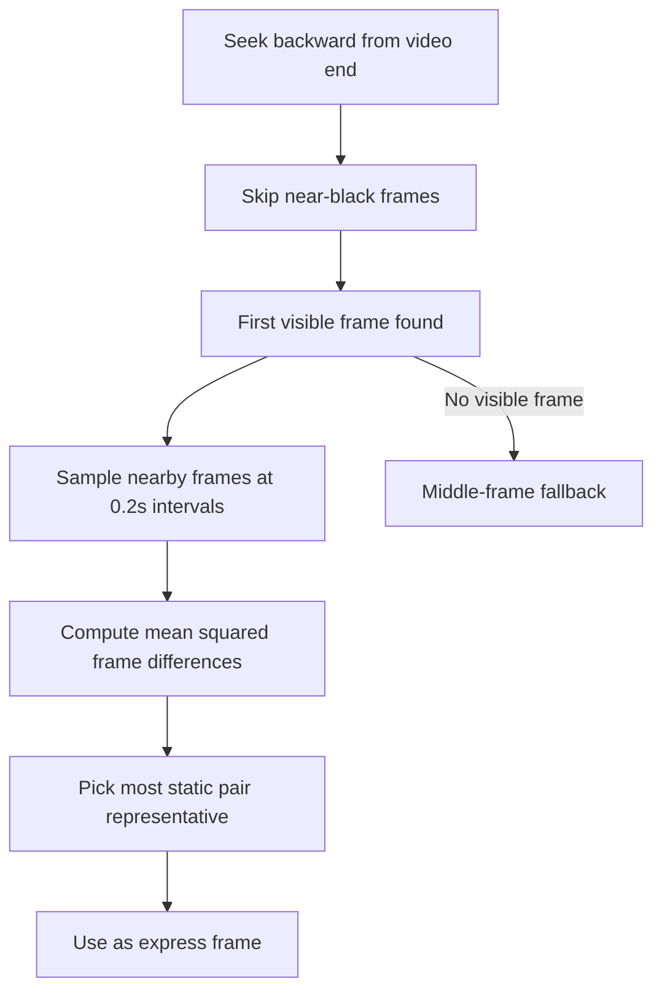

# OCR Architecture

This document describes the OCR-oriented classification architecture in the Video Ad Classification Service. It is intentionally detailed and maps to the implemented behavior in:

- `video_service/core/video_io.py`
- `video_service/core/ocr.py`
- `video_service/core/pipeline.py`
- `video_service/workers/worker.py`

It covers:

- the default tail-pass OCR path
- the image-processing heuristics used to reduce OCR cost
- the adaptive rescue ladder for difficult ads
- `Express Mode` and `Express Rescue`
- observability, retry traces, and operating knobs

## 1. Non-Technical Overview

Most ad videos are easiest to classify at the end.

Why:

- many ads end with a branded end card
- the last seconds often contain a logo, slogan, URL, or product shot
- scanning only the tail is much cheaper than scanning the full video

The system therefore starts with a fast path:

1. look at the last ~3 seconds
2. pick a few representative frames
3. run OCR only where it is likely to help
4. send OCR plus a final frame to the classifier

This handles the majority of jobs quickly.

The problem is that some ads are pathological:

- the last frames fade to black
- the visible text is real but missed by the OCR heuristics
- the end card is visually obvious but OCR is empty
- the useful frame is slightly earlier than the final 3 seconds

To solve that, the pipeline does **not** make every job slower. Instead, it uses a staged fallback ladder that only activates when the normal tail pass fails:

1. `Initial Tail Pass`
2. `OCR Rescue`
3. `Express Rescue`
4. `Extended Tail`
5. `Full Video`

This means the common case stays fast, and only edge cases pay for the extra work.

## 2. Mental Model

There are two distinct but related ideas:

### 2.1 OCR is evidence, not the whole classifier

OCR helps extract:

- brand names
- URLs/domains
- slogans
- regulatory or descriptive text

But the final classifier can also use:

- a keyframe image sent to a multimodal model
- vision-category similarity scores
- category mapping into the canonical taxonomy

### 2.2 Tail-first is a latency optimization

The pipeline is intentionally biased toward the tail because that is where end cards usually live.

It is not trying to understand the whole narrative arc of the ad first. It is trying to cheaply capture the strongest brand evidence.

## 3. DSP / Image-Processing Primer

This codebase does not implement formal signal processing in the academic DSP sense, but it does use several lightweight image-analysis techniques that are signal-processing-adjacent. For an uninitiated reader, these are the important ones.

### 3.1 Brightness gating

Frames that are nearly black are often useless:

- fades to black
- transition slates
- between-scene gaps

The system computes grayscale mean brightness and uses it to:

- reject near-black frames during rescue sampling
- avoid walking backward from a black tail anchor
- determine whether a frame is good enough to skip OCR entirely in multimodal mode

### 3.2 Histogram similarity

A color histogram is a compact summary of how much of the frame contains a given range of colors.

The code uses HSV hue/saturation histograms to detect when multiple tail frames are visually almost identical.

Why HSV instead of raw RGB/BGR:

- more robust to brightness changes
- better at detecting “same slide/endcard with slight luminance variation”

This is used to:

- detect static end cards
- skip OCR on redundant frames
- collapse an entire static tail run to a single last frame

### 3.3 Sharpness estimation

Sharpness is approximated with Laplacian variance.

Intuition:

- blurry frames have weaker edge energy
- sharp text and logos have stronger local contrast changes

This is used in the high-confidence OCR-skip gate to avoid trusting a bad frame.

### 3.4 Text-region proposal

The ROI-first OCR path tries to find likely horizontal text bands using image gradients.

The algorithm is:

1. downscale the frame for cheaper analysis
2. convert to grayscale
3. compute horizontal edge strength via Sobel-X
4. blur slightly to reduce noise
5. threshold with Otsu to separate strong edge structures
6. close/dilate morphologically to connect nearby text strokes
7. keep wide, sufficiently large contours
8. union those boxes into one OCR focus region

This works well for common end cards because many end cards place text in horizontal strips:

- slogan bars
- URL bands
- legal text blocks
- lower-third product copy

### 3.5 Static-frame detection for Express Mode

`Express Mode` looks backward from the end of the video, skips black frames, then samples nearby frames and chooses the one with the smallest mean squared difference to its neighbor.

Practical meaning:

- it tries to find the most stable branded plate near the end
- that is often the best single frame for multimodal classification

## 4. High-Level Pipeline

## 5. Default Tail Pass

The default path for standard pipeline mode is a tail-only scan.

### 5.1 Tail extraction

Implemented in `extract_frames_for_pipeline(...)`.

Behavior:

- if `scan_mode` is `Full Video`, sample every ~2 seconds across the whole video
- otherwise sample only the last ~3 seconds
- by default target roughly 5 tail frames

Relevant knobs:

- `TAIL_TARGET_FRAMES` default `5`
- tail window fixed at `3` seconds in the implementation

This avoids the earlier bug where tail sampling step size scaled with full video duration and produced only one frame for normal ad lengths.

### 5.2 Static-tail backward extension

After tail extraction, `_maybe_extend_tail_frames(...)` may walk backward when all tail frames are nearly identical.

Purpose:

- detect static end cards
- reach slightly earlier content when the tail is a frozen legal slate or network bumper

Mechanism:

- compute HSV H/S histograms for all tail samples
- compare consecutive pairs with histogram correlation
- if all correlations are above threshold, treat the tail as static
- walk backward in 2-second hops
- stop when correlation drops below threshold or max walkback is reached

Relevant knobs:

- `TAIL_STATIC_THRESHOLD` default `0.97`
- `TAIL_MAX_BACKWARD_SECONDS` default `12`

Important caveat:

- if the last frame brightness is near absolute black (`< 5.0`), the backward walk aborts to avoid treating a fade-out as a branded end card anchor

## 6. OCR Cost-Reduction Inside the Tail Pass

The pipeline aggressively reduces OCR cost before invoking the OCR engine.

### 6.1 Visual prefilter before OCR

Implemented in `_select_frames_for_ocr(...)`.

Behavior:

- compute a compact HSV histogram signature per frame
- compare each candidate frame against the last selected frame
- skip visually redundant intermediate frames
- always preserve the last frame
- if only two representatives remain and they are still visually identical, collapse to the last frame only

Relevant knob:

- `OCR_FRAME_SIMILARITY_THRESHOLD` default `0.985`

This matters because text-level dedup after OCR does not save compute. Pre-OCR filtering does.

### 6.2 ROI-first OCR

Implemented in `_extract_ocr_focus_region(...)` and used in `_do_ocr(...)`.

Behavior:

- attempt OCR on a likely text ROI first
- if the ROI text is weak, retry on the full frame

Relevant knob:

- `OCR_ROI_FIRST` default `true`

This improves latency because OCR on a tighter crop is cheaper than OCR on a full 1080p frame.

### 6.3 Skip frames with no plausible text region

Behavior:

- when ROI detection finds no plausible text region on a non-final frame, skip OCR for that frame entirely
- the last frame is still preserved as a safety attempt

Relevant knob:

- `OCR_SKIP_NO_ROI_FRAMES` default `true`

### 6.4 EasyOCR input resizing

Implemented in `OCRManager._prepare_easyocr_image(...)`.

Behavior:

- in fast mode, downscale large inputs before OCR
- detailed mode can keep full resolution unless configured otherwise

Relevant knobs:

- `EASYOCR_MAX_DIMENSION_FAST` default `960`
- `EASYOCR_MAX_DIMENSION_DETAILED` default `0` meaning no resize by default

### 6.5 Fast vs Detailed OCR mode

EasyOCR is split heuristically into:

- `Fast`
- `Detailed`

Fast mode:

- `detail=0`
- `min_size=20`
- `text_threshold=0.8`
- `width_ths=0.7`
- optional input downscale

Detailed mode:

- `detail=1`
- `min_size=8`
- `text_threshold=0.6`
- `width_ths=0.5`
- default full-resolution behavior

This is not the same as beam-search style inference in Florence-2, but it is a pragmatic speed/recall split.

### 6.6 Text-level dedup after OCR

Even after frame prefiltering, OCR outputs can still be repetitive. The pipeline therefore deduplicates OCR text lines with Jaccard-style token overlap.

Relevant knob:

- `OCR_DEDUP_THRESHOLD` default `0.85`

### 6.7 Early stop after strong OCR signal

Once a sufficiently strong OCR signal is found on an intermediate frame, the tail OCR path can skip remaining intermediate frames and jump directly to the final frame.

Relevant knobs:

- `OCR_EARLY_STOP_ENABLED` default `true`
- `OCR_EARLY_STOP_MIN_CHARS` default `12`

The last frame is still preserved.

## 7. High-Confidence OCR Skip

This is a distinct optimization from rescue logic.

The system may skip OCR entirely when a multimodal classification is already strong enough.

### 7.1 Conditions

All of the following must hold:

- OCR-skip feature enabled
- not in express mode
- not in full-video mode
- web search disabled
- vision board enabled
- LLM keyframe enabled
- provider/model supports vision
- pre-OCR frame selector collapsed to exactly one frame
- frame quality passes brightness and sharpness thresholds
- vision scorer is strong and stable
- preliminary multimodal LLM result has:
  - non-empty brand
  - non-empty category
  - confidence above threshold
  - mapped category aligned with top vision category

Relevant knobs:

- `OCR_SKIP_HIGH_CONFIDENCE` default `true`
- `OCR_SKIP_CONFIDENCE_THRESHOLD` default `0.90`
- `OCR_SKIP_VISION_SCORE_THRESHOLD` default `0.80`
- `OCR_SKIP_MIN_BRIGHTNESS` default `20`
- `OCR_SKIP_MIN_SHARPNESS` default `40`

### 7.2 Rationale

If a visually explicit end card already yields a stable, high-confidence multimodal answer, OCR is pure latency with little incremental value.

## 8. Edge-Case Rescue Ladder

The rescue ladder only runs when the initial tail pass is weak.

Trigger condition:

- OCR text has no real signal, and
- the initial LLM result is blank/unknown/zero-confidence

Relevant knob:

- `OCR_EDGE_RESCUE_ENABLED` default `true`

### 8.1 Why the ladder exists

The pathological cases are different from ordinary failures:

- fade-to-black tails
- visible text missed by ROI heuristics
- single-frame selection failures
- ads where image evidence is stronger than OCR

Instead of making every job more expensive, the system escalates only these failures.

### 8.2 Ladder order

## 9. OCR Rescue

`OCR Rescue` is the first recovery mechanism.

### 9.1 What it does

It widens the temporal search window without changing the normal fast-path cost.

Implemented via `extract_tail_rescue_frames(...)`.

Behavior:

- sample the last `N` seconds instead of just the last `3`
- skip frames below a minimum brightness threshold
- if all sampled frames are dark, keep the brightest sampled frame anyway
- force a more permissive OCR profile
- disable the aggressive fast-path assumptions that are useful for healthy jobs but dangerous in edge cases

Relevant knobs:

- `OCR_RESCUE_TAIL_WINDOW_SECONDS` default `12`
- `OCR_RESCUE_TAIL_STEP_SECONDS` default `1.0`
- `OCR_RESCUE_MIN_BRIGHTNESS` default `5.0`

### 9.2 OCR behavior during rescue

Rescue OCR uses:

- `🧠 Detailed` mode for EasyOCR
- no aggressive visual prefilter skip count beyond the rescue candidate set
- no no-ROI dropping
- no early stop

The rescue path is intentionally less clever and more exhaustive because it only runs after the fast path already failed.

### 9.3 Acceptance criteria

`OCR Rescue` is accepted only if:

- OCR text now has usable signal, and
- the retry LLM result is not blank/unknown/zero-confidence

## 10. Express Rescue

`Express Rescue` is the second recovery mechanism.

It is image-first, not OCR-first.

### 10.1 What it does

- extract a representative static branded frame near the end
- bypass OCR for the retry itself
- retry classification using the image directly with `express_mode=True`

This is valuable when:

- the end card is visually explicit
- OCR remains empty or weak
- the multimodal model can still identify the brand/category from the frame itself

### 10.2 Why it comes before extended tail and full video

This ordering is deliberate.

If the ad’s final plate is visually obvious, express rescue is often both:

- cheaper than a large OCR retry
- more reliable than forcing OCR to read a stylized end card

## 11. Extended Tail

`Extended Tail` is the third rescue mechanism.

### 11.1 What it does

It repeats the rescue OCR strategy but with a wider temporal window than the first OCR rescue.

Relevant knobs:

- `OCR_EXTENDED_TAIL_RESCUE_ENABLED` default `true`
- `OCR_EXTENDED_TAIL_WINDOW_SECONDS` default `30`
- `OCR_EXTENDED_TAIL_STEP_SECONDS` default `2.0`

### 11.2 Why it exists

Some ads place the useful end card earlier than the final few seconds, especially when the video ends with:

- broadcaster slates
- legal holds
- black fades
- promo bumpers

`Extended Tail` reaches further back without paying full-video cost yet.

## 12. Full Video

`Full Video` is the last-resort rescue mechanism.

### 12.1 What it does

- sample across the whole video
- limit the number of rescue frames to avoid runaway cost
- retry OCR + LLM on that frame set

Relevant knobs:

- `OCR_FULL_VIDEO_RESCUE_ENABLED` default `true`
- `OCR_FULL_VIDEO_RESCUE_MAX_FRAMES` default `24`

### 12.2 Why it is last

Full-video fallback is both:

- the most expensive option
- the noisiest option, because it includes more non-endcard content

It is therefore only appropriate after narrower recovery paths fail.

## 13. Express Mode vs Express Rescue

These two are related but different.

### 13.1 Express Mode

`Express Mode` is an explicit job mode chosen up front.

Behavior:

- bypasses OCR entirely
- extracts a representative static end frame
- classifies from image evidence directly

Use when:

- latency matters more than OCR-derived evidence
- the ad inventory is dominated by clean, visually explicit end cards

### 13.2 Express Rescue

`Express Rescue` is **not** a user-selected main mode.

It is an adaptive fallback used only after the normal OCR-centric path has already failed.

### 13.3 Comparison table

| Mechanism | When it runs | OCR used? | Purpose |
| --- | --- | --- | --- |
| Express Mode | Chosen at job start | No | Fastest image-first path |
| Express Rescue | Only after initial failure | No | Recover visually obvious edge cases |

## 14. Category Mapping After Classification

The LLM may emit a raw, informal, or non-canonical category label such as:

- `Automobiles`
- `Educational Media / Historical Documentary`
- `Non-profit / Educational Organization`

This raw category is normalized by the category mapper into the canonical FreeWheel taxonomy.

The persisted result includes:

- canonical category
- category ID
- mapper method
- mapper score

This is why the final result may differ slightly from the exact raw LLM phrasing.

## 15. Observability and Execution Trace

Observability is part of the product, not a debugging afterthought.

### 15.1 Runtime logs

The OCR pipeline emits structured logs such as:

- `ocr_frame_prefilter`
- `ocr_dedup`
- `ocr_skip_accepted`
- `ocr_skip_rejected`
- `tail_rescue_sampling`
- `fallback_triggered`
- `fallback_accepted`
- `fallback_rejected`
- `fallback_exhausted`

### 15.2 Persisted processing trace

Each processed job stores a `processing_trace` artifact containing:

- overall mode and selected settings
- attempt list
- per-attempt status
- trigger reason
- frame times
- OCR excerpt
- OCR signal flag
- result snapshot
- elapsed time
- final summary headline

This is used by the `Explain` tab to show:

- the decision flow
- attempt cards
- frame filmstrips
- category journey
- operator notes

without re-running OCR or classification.

## 16. Mermaid: Detailed Decision Graph

## 17. Mermaid: Express Frame Selection

## 18. Environment Knobs

### 18.1 Tail extraction and static detection

| Variable | Default | Purpose |
| --- | --- | --- |
| `TAIL_TARGET_FRAMES` | `5` | Number of tail frames to target in the default 3-second tail window |
| `TAIL_STATIC_THRESHOLD` | `0.97` | Histogram-correlation threshold for deciding the tail is static |
| `TAIL_MAX_BACKWARD_SECONDS` | `12` | Maximum backward walk when the tail is static |

### 18.2 OCR optimization

| Variable | Default | Purpose |
| --- | --- | --- |
| `OCR_DEDUP_THRESHOLD` | `0.85` | Text-similarity threshold for OCR line dedup |
| `OCR_FRAME_SIMILARITY_THRESHOLD` | `0.985` | Visual similarity threshold for pre-OCR frame dedup |
| `OCR_ROI_FIRST` | `true` | Enable ROI-first OCR |
| `OCR_SKIP_NO_ROI_FRAMES` | `true` | Skip non-final frames that have no plausible text region |
| `OCR_EARLY_STOP_ENABLED` | `true` | Enable early stop after strong OCR signal |
| `OCR_EARLY_STOP_MIN_CHARS` | `12` | Minimum character threshold for strong OCR signal |
| `EASYOCR_MAX_DIMENSION_FAST` | `960` | Resize limit for EasyOCR fast mode |
| `EASYOCR_MAX_DIMENSION_DETAILED` | `0` | Resize limit for EasyOCR detailed mode; `0` means disabled |

### 18.3 OCR skip gate

| Variable | Default | Purpose |
| --- | --- | --- |
| `OCR_SKIP_HIGH_CONFIDENCE` | `true` | Enable OCR skip when multimodal evidence is already strong |
| `OCR_SKIP_CONFIDENCE_THRESHOLD` | `0.90` | Minimum LLM confidence required for OCR skip |
| `OCR_SKIP_VISION_SCORE_THRESHOLD` | `0.80` | Minimum vision score required for OCR skip |
| `OCR_SKIP_MIN_BRIGHTNESS` | `20` | Minimum brightness for OCR skip candidate frame |
| `OCR_SKIP_MIN_SHARPNESS` | `40` | Minimum sharpness for OCR skip candidate frame |

### 18.4 Rescue ladder

| Variable | Default | Purpose |
| --- | --- | --- |
| `OCR_EDGE_RESCUE_ENABLED` | `true` | Enable rescue ladder after a failed initial pass |
| `OCR_RESCUE_TAIL_WINDOW_SECONDS` | `12` | Window for first rescue-tail scan |
| `OCR_RESCUE_TAIL_STEP_SECONDS` | `1.0` | Sampling step for first rescue-tail scan |
| `OCR_RESCUE_MIN_BRIGHTNESS` | `5.0` | Brightness floor for rescue-tail sampling |
| `EXPRESS_RESCUE_ENABLED` | `true` | Enable express rescue |
| `OCR_EXTENDED_TAIL_RESCUE_ENABLED` | `true` | Enable extended-tail rescue |
| `OCR_EXTENDED_TAIL_WINDOW_SECONDS` | `30` | Window for extended-tail rescue |
| `OCR_EXTENDED_TAIL_STEP_SECONDS` | `2.0` | Sampling step for extended-tail rescue |
| `OCR_FULL_VIDEO_RESCUE_ENABLED` | `true` | Enable full-video rescue |
| `OCR_FULL_VIDEO_RESCUE_MAX_FRAMES` | `24` | Cap the number of frames used in full-video rescue |

## 19. Failure Modes and Tradeoffs

### 19.1 Why not always run full video?

Because it is expensive and noisy.

Tradeoff:

- higher recall in some cases
- much higher latency
- more irrelevant OCR text

### 19.2 Why not always use Express Mode?

Because some ads are only recoverable from text.

Examples:

- weak logo, strong URL
- legal or sponsor text disambiguates the brand
- visual end card is stylistic rather than explicit

### 19.3 Why keep both OCR-centric and image-centric paths?

Because ad inventories are heterogeneous.

Some ads are text-dominant. Others are image-dominant. The rescue ladder exists precisely because a single strategy is not uniformly correct.

### 19.4 Why does the system still sometimes need retries?

Because end-card extraction is a best-effort heuristic problem, not a deterministic parse. Ads vary in:

- typography
- pacing
- fade behavior
- legal overlays
- broadcaster slates
- framing and motion

The correct engineering response is not to make the hot path exhaustive. It is to keep the hot path fast and make the fallback path explicit and observable.

## 20. Practical Reading Guide

If you are debugging a bad job, inspect in this order:

1. `processing_trace.summary`
2. attempt statuses and trigger reasons
3. frame times used by the accepted attempt
4. OCR excerpt on the accepted or rejected attempt
5. fallback logs in this order:
   - `fallback_triggered`
   - `fallback_accepted`
   - `fallback_rejected`
   - `fallback_exhausted`
6. final category mapping:
   - raw category vs canonical category
   - mapper score
   - category ID

## 21. Summary

The OCR architecture is intentionally asymmetric:

- fast on the common case
- exhaustive only on failure
- observable at every retry boundary

That is the central design principle.

The system is not trying to prove that one OCR strategy is universally correct. It is trying to:

- get the majority of ads right cheaply
- recover difficult ads through staged retries
- preserve enough trace data that an operator can understand what happened after the fact
